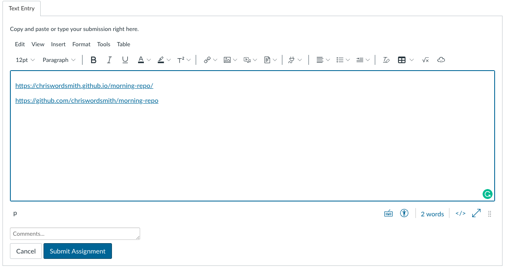

# morning-repo Refactor site

## Description 

This project is a practice project I am using to learn how to refactor code. 

I added semantic HTML elements to replace div tags
I added alt tags
I added better meta descriptions and meta data
I changed the HTML formatting to make it easier to read for the next developer
I fixed typos in the copy and grammatical issues

## Usage 

```md

```

## Credits

Credit to Drew Hoang for helping create the content for this site and repo.


## License

See file in repo.

---

